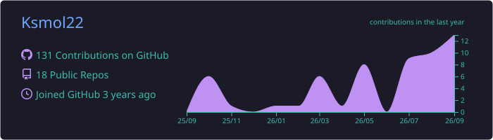
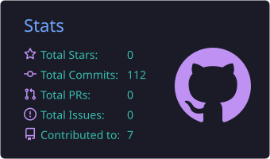
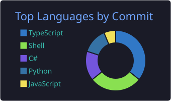
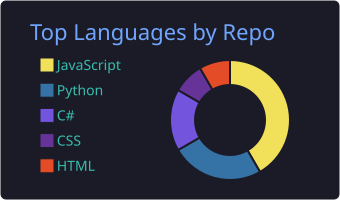
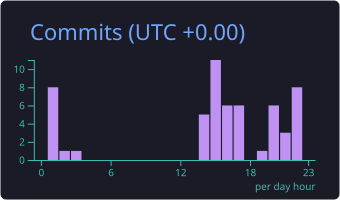

<!-- ═══════════════════════════ ENCABEZADO ═══════════════════════════ -->
<div align="center">
  

  

  <br>

  <a href="https://github.com/Ksmol22">
    
  </a>
  <a href="https://www.linkedin.com/in/kevin-molina-81a476222/">
    
  </a>
  <a href="mailto:molinalarak@gmail.com">
    
  </a>

  <br><br>

  
  
  
</div>


## 👨‍💻 Sobre mí

Soy estudiante de **Ingeniería de Software** con enfoque en **infraestructura, bases de datos, automatización y observabilidad**. Me gusta trabajar en el punto donde se unen el desarrollo de software y la infraestructura de TI: construyo herramientas que automatizan operaciones repetitivas, mejoran la visibilidad de los sistemas y ayudan a los equipos a resolver incidentes más rápido.

```python
class KevinMolina:
    def __init__(self):
        self.rol          = "Estudiante de Ingeniería de Software"
        self.enfoque      = ["Infraestructura", "Bases de datos", "Automatización", "Observabilidad"]
        self.sistemas     = ["Linux", "Windows", "Redes"]
        self.bases_datos  = ["Oracle", "PostgreSQL", "SQL Server", "MySQL", "MongoDB"]
        self.lenguajes    = ["Python", "Bash", "JavaScript", "TypeScript"]
        self.herramientas = ["Docker", "Ansible", "Git", "FastAPI"]
        self.aprendiendo  = ["Cloud", "Infraestructura como Código", "Servicios distribuidos"]
        self.filosofia    = "Si es repetitivo, se automatiza. Si importa, se documenta."

    def disponible_para(self):
        return ["Proyectos open source", "Colaboraciones", "Prácticas y oportunidades en infraestructura"]
```

<details>
<summary><b>⚡ Datos rápidos (clic para expandir)</b></summary>
<br>

- 🔭 Actualmente trabajando en **Themisec**, una plataforma de monitoreo de infraestructura.
- 🌱 Aprendiendo **cloud, contenedores e Infraestructura como Código**.
- 🧩 Me interesa entender los sistemas de punta a punta: desde la aplicación hasta el servidor.
- 🛠️ Disfruto convertir tareas manuales en scripts confiables y reutilizables.
- 💬 Pregúntame sobre **bases de datos, Linux, automatización o monitoreo**.
- 📫 La mejor forma de contactarme: **molinalarak@gmail.com**

</details>


## 🎯 Lo que hago

| 🖥️ Infraestructura | 🗄️ Administración de Bases de Datos |
| :--- | :--- |
| • Administración de Linux y Windows<br>• Diagnóstico de aplicaciones<br>• Monitoreo de servicios y recursos<br>• Diagnóstico de infraestructura<br>• Análisis de incidentes en producción<br>• Documentación técnica | • Oracle, PostgreSQL, SQL Server<br>• MySQL, MongoDB<br>• Rendimiento y troubleshooting operativo<br>• Automatización de respaldos y mantenimiento<br>• Consultas, índices y optimización<br>• Usuarios, roles y permisos |

| ⚙️ Automatización | 📊 Observabilidad |
| :--- | :--- |
| • Automatización con Python<br>• Scripts en Shell y playbooks de Ansible<br>• Herramientas operativas<br>• Health checks y verificación de respaldos<br>• Reportes automáticos<br>• Tareas programadas (cron / Task Scheduler) | • Monitoreo de infraestructura<br>• Recolección de métricas<br>• Análisis de logs y alertas<br>• Dashboards de salud<br>• Conceptos de detección de anomalías<br>• Disponibilidad y tiempos de respuesta |


## 🚀 Proyectos destacados

<div align="center">
  <table>
    <tr>
      <td width="50%" valign="top">
        <h3>🔭 Themisec</h3>
        <b>Monitoreo de Infraestructura y Observabilidad</b><br><br>
        Plataforma de monitoreo que brinda visibilidad sobre:
        <ul>
          <li>Servidores Windows y Linux</li>
          <li>Oracle, PostgreSQL, MySQL, SQL Server</li>
          <li>Infraestructura de red (HTTP/S, DNS, Ping)</li>
          <li>Estado de servicios y alertas</li>
        </ul>
        
        
        
      </td>
      <td width="50%" valign="top">
        <h3>🐾 UVeterinaria</h3>
        <b>Plataforma de Gestión Veterinaria</b><br><br>
        Sistema de negocio para gestionar operaciones veterinarias:
        <ul>
          <li>Pacientes, historias clínicas y vacunas</li>
          <li>Citas, facturación e inventario</li>
          <li>Reportes y notificaciones</li>
        </ul>
        
        
        
      </td>
    </tr>
    <tr>
      <td width="50%" valign="top">
        <h3>💰 FinanzasFácil</h3>
        <b>Plataforma de Finanzas Personales</b><br><br>
        Aplicación financiera orientada al backend:
        <ul>
          <li>Transacciones y presupuestos</li>
          <li>Autenticación con JWT</li>
          <li>Arquitectura basada en API REST</li>
        </ul>
        
        
        
      </td>
      <td width="50%" valign="top">
        <h3>⚙️ Automatización de Infraestructura</h3>
        <b>Kit de Herramientas Operativas</b><br><br>
        Scripts y herramientas para reducir tareas repetitivas:
        <ul>
          <li>Automatización de respaldos y health checks</li>
          <li>Análisis de logs y validación de servicios</li>
          <li>Operaciones de BD y reportes automáticos</li>
        </ul>
        
        
        
      </td>
    </tr>
  </table>
</div>


## 🧰 Stack tecnológico

<div align="center">

**Infraestructura y DevOps**<br><br>


**Desarrollo**<br><br>


**Bases de datos**<br><br>


**Herramientas**<br><br>


</div>


## 🏗️ Cómo pienso la infraestructura

```text
                         ┌─────────────────┐
                         │   APLICACIÓN    │
                         └────────┬────────┘
                                  ▼
                         ┌─────────────────┐
                         │      APIs       │
                         └────────┬────────┘
                                  ▼
              ┌──────────────────────────────────┐
              │          BASES DE DATOS          │
              │ Oracle · PostgreSQL · SQL Server │
              │ MySQL · MongoDB                  │
              └───────────────┬──────────────────┘
                              ▼
              ┌──────────────────────────────────┐
              │         INFRAESTRUCTURA          │
              │ Linux · Windows · Redes          │
              └───────────────┬──────────────────┘
                 ┌────────────┴────────────┐
                 ▼                         ▼
        ┌────────────────┐       ┌────────────────┐
        │ AUTOMATIZACIÓN │       │ OBSERVABILIDAD │
        │  Python        │       │  Métricas      │
        │  Shell         │       │  Logs          │
        │  Ansible       │       │  Alertas       │
        └───────┬────────┘       └───────┬────────┘
                └────────────┬───────────┘
                             ▼
                   ┌──────────────────┐
                   │   CONFIABILIDAD  │
                   └──────────────────┘
```


## 📈 Actividad en GitHub

<div align="center">
  
  <br>
  
  
  <br>
  
  
  <br><br>
  
</div>

### 🐍 Contribuciones

<div align="center">
  <picture>
    <source media="(prefers-color-scheme: dark)" srcset="https://raw.githubusercontent.com/Ksmol22/Ksmol22/output/github-snake-dark.svg" />
    <source media="(prefers-color-scheme: light)" srcset="https://raw.githubusercontent.com/Ksmol22/Ksmol22/output/github-snake.svg" />
    
  </picture>
</div>


## 🔬 Construyendo y aprendiendo

| Área | Enfoque | Progreso |
| :--- | :--- | :---: |
| 🖥️ **Infraestructura** | Linux · Windows · Sistemas |  |
| 🗄️ **Bases de datos** | Oracle · PostgreSQL · SQL Server |  |
| ⚙️ **Automatización** | Python · Shell · Ansible |  |
| 📊 **Observabilidad** | Monitoreo · Logs · Métricas |  |
| 🐳 **Contenedores** | Docker · Servicios contenerizados |  |
| ☁️ **Cloud** | Infraestructura y despliegue en la nube |  |
| 🚀 **Backend** | APIs · FastAPI · Servicios distribuidos |  |


### 🗺️ Hoja de ruta

- [x] Administración de Linux y Windows
- [x] Bases de datos relacionales y NoSQL
- [x] Automatización con Python y Shell
- [x] APIs REST con FastAPI
- [x] Infraestructura como Código (Terraform)
- [x] CI/CD con GitHub Actions
- [x] Orquestación de contenedores (Kubernetes)
- [x] Stack de observabilidad (Prometheus · Grafana · Loki)
- [ ] Certificación en cloud


## 🧠 Principios de ingeniería

```yaml
ingenieria:
  confiabilidad:   "Los sistemas deben ser observables y predecibles."
  automatizacion:  "Si es repetitivo, se automatiza."
  documentacion:   "Si importa, se documenta."
  monitoreo:       "No puedes mejorar lo que no puedes medir."
  seguridad:       "La infraestructura se diseña pensando en la seguridad."
  simplicidad:     "La solución más simple que funcione suele ser la mejor."
  aprendizaje:     "La tecnología cambia. Aprender siempre es obligatorio."
```


## 🤝 Abierto a colaborar

Me interesan proyectos open source o colaboraciones relacionadas con:

- 🛡️ Ingeniería de infraestructura y confiabilidad (SRE)
- 🗄️ Administración de bases de datos
- 📊 Monitoreo y observabilidad
- ⚙️ DevOps, automatización e Infraestructura como Código (IaC)
- 🚀 Desarrollo backend y herramientas técnicas

<div align="center">

### 💬 Frase favorita

> *"Primero resuelve el problema. Después, escribe el código."*<br>
> — John Johnson

</div>


## 📫 Conectemos

<div align="center">
  <a href="https://www.linkedin.com/in/kevin-molina-81a476222/">
    
  </a>
  <a href="mailto:molinalarak@gmail.com">
    
  </a>
  <a href="https://github.com/Ksmol22">
    
  </a>

  <br><br>
  <i>Infraestructura · Bases de datos · Automatización · Observabilidad · Ingeniería de Software</i>
</div>


