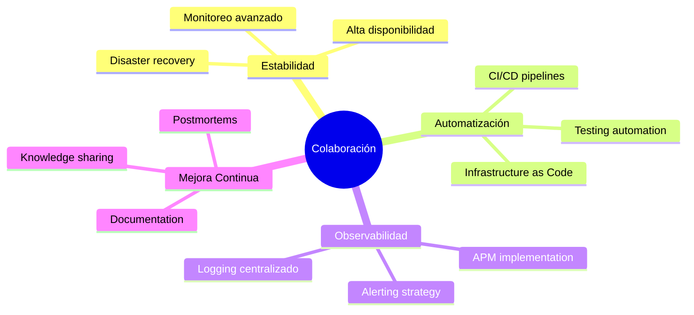

<div align="center">

# 👋 ¡Hola! Soy Kevin Molina (@Ksmol22)

### Ing de infraestructura DBA • Administrador de Sistemas • Desarrollador


[](https://www.linkedin.com/in/kevin-molina-81a476222/)
[](https://github.com/Ksmol22)
[](https://github.com/Ksmol22)

</div>

---

## 🚀 Sobre mí

```typescript
const kevin = {
    role: "Application Support Specialist & SysAdmin",
    location: "🌎",
    motto: "Una idea hoy, una aventura mañana!",
    currentFocus: ["System Stability", "Automation", "Monitoring & Observability"],
    passions: ["Problem Solving", "Continuous Learning", "Process Optimization"],
    lifeBalance: ["🏀 Basketball", "✈️ Traveling", "📚 Reading"]
};
```

<div align="center">
### 🐍 Mis Commits 


</div>
### 💼 Lo que hago día a día

</div>

<table>
<tr>
<td width="50%">

🔧 **Operaciones & Soporte**
- Mantener aplicaciones críticas en producción
- Diagnóstico y resolución de incidencias
- Implementación de monitoreo y alertas
- Documentación técnica y postmortems

</td>
<td width="50%">

⚡ **Automatización & Mejora**
- Scripts para backups y verificación
- Automatización de tareas operativas
- Optimización de pipelines
- Dashboards de salud y métricas

</td>
</tr>
</table>

---

## 🛠️ Stack Tecnológico

<div align="center">

### 💻 Lenguajes


### 🗄️ Bases de Datos


### ⚙️ DevOps & Tools


</div>

---

## 📊 Estadísticas de GitHub

<div align="center">
  


</div>

<div align="center">

### 🔥 Racha de Contribuciones

[](https://git.io/streak-stats)


---

## 🏆 Logros de GitHub

<div align="center">

[](https://github.com/ryo-ma/github-profile-trophy)

</div>

---

## 🎯 Proyectos Destacados

<div align="center">

<table>
<tr>
<td width="50%">

### 🔐 Automatización de Backups
Sistema automático de respaldo con:
- ✅ Verificación de integridad
- 📧 Alertas contextuales
- 📊 Reportes de estado

</td>
<td width="50%">

### 📈 Dashboards de Monitoreo
Visualización en tiempo real:
- 🎯 Métricas de salud
- ⚠️ Alertas priorizadas
- 📉 Análisis de tendencias

</td>
</tr>
<tr>
<td width="50%">

### 🚨 Playbooks de Incidentes
Scripts para diagnóstico rápido:
- 🔍 Análisis de logs
- ⚡ Resolución automatizada
- 📝 Documentación integrada

</td>
<td width="50%">

### 🤖 Scripts de Automatización
Pipelines optimizados:
- 🔄 Despliegues seguros
- 🧪 Testing automatizado
- 📦 Gestión de dependencias

</td>
</tr>
</table>

</div>

---

## 🤝 Busco Colaborar En

<div align="center">



</div>

- 🎯 Aumentar la estabilidad de aplicaciones críticas
- 🤖 Automatizar pipelines y tareas operativas
- 🔍 Implementar observabilidad completa
- 📚 Respuesta a incidentes y postmortems efectivos

---

## 📫 ¡Conectemos!

<div align="center">

[](https://www.linkedin.com/in/kevin-molina-81a476222/)
[](https://github.com/Ksmol22)
[](mailto:molinalarak@gmail.com)

</div>

---

## ⚽ Cuando No Estoy Programando...

<div align="center">

| 🏀 Basketball | ✈️ Viajando | 📚 Leyendo |
|:---:|:---:|:---:|
| Jugando y manteniéndome activo | Descubriendo nuevas culturas | Aprendiendo constantemente |

</div>


**Hecho con ❤️ y mucho ☕**

</div>
